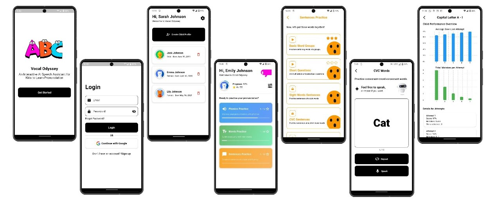

# Vocal-Odyssey

**Vocal Odyssey** is an AI-powered mobile application designed to help young children improve their **pronunciation and speech skills** through structured, engaging, and interactive learning. Developed as our final year project, it combines gamified learning with real-time speech evaluation to provide a hands-on pronunciation training experience unlike traditional passive learning platforms.

---

## 🚀 Project Repositories

🔗 **Frontend (Flutter):**  
[https://github.com/abd-ul-rafay/Vocal-Odyssey-Frontend](https://github.com/abd-ul-rafay/Vocal-Odyssey-Frontend)

🔗 **Backend (Node.js + Express):**  
[https://github.com/abd-ul-rafay/Vocal-Odyssey-Backend](https://github.com/abd-ul-rafay/Vocal-Odyssey-Backend)

---

## 🧠 What We Built

We built **Vocal Odyssey**, a mobile app that helps children improve their pronunciation through interactive, level-based learning. Unlike typical passive learning apps, ours focuses on **active speaking practice** with real-time feedback.

### 📱 How It Works

- Kids progress through levels: **phonics → words → sentences**
- Each word is played using **text-to-speech**
- Kids repeat it — their speech is scored using **AI**
- They earn **stars and rewards** for correct pronunciation
- **Parents/teachers** can track progress with graphs and reports
- **Admins** can manage users and levels across modules

---

## 🛠 Tech Stack

- **Flutter** (frontend)  
- **Node.js + Express** (backend)  
- **MongoDB** (database)  
- **APIs:**
  - Text-to-Speech: [Murf.ai](https://murf.ai/api/docs/)
  - Speech Evaluation: [Speechace](https://docs.speechace.com/)

---

 ## 📷 Screenshots

---
